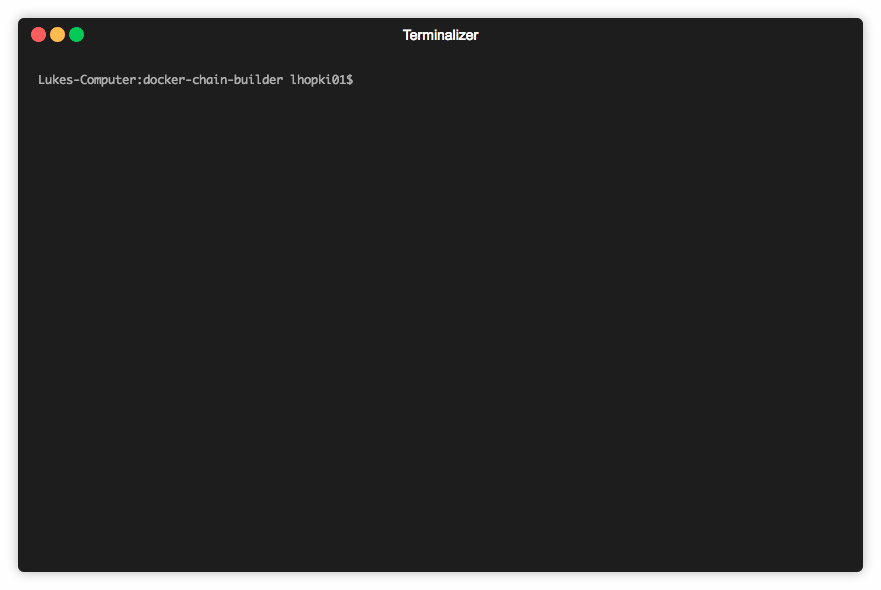

## docker-chain-builder

docker-chain-builder is a tool to build and push chains of dependent docker images.
First a dependency graph is created and then docker-chain-builder walks the graph updating the VERSION files and the FROM lines in the Dockerfile.
It then walks the graph building the docker images in the right order.  All images that can be built in parallel are built in parallel.
All versions are in semver.
Individual docker images that are not part of a chain can be built too.
If fed a list of images docker-chain-builder will figure out which images are the start of chains and build all the chains simultaneously.



## Installation

```
brew tap lhopki01/brew git@github.com:lhopki01/brew
brew install docker-chain-builder
```
If you have installed `docker-chain-builder` before you need to remove the old tap
```
brew untap lhopki01/docker-chain-builder
```

## Setup

All Dockerfiles should be in separate folders named after the docker repository (not registry)
Create a VERSION file in each folder with an initial version.

Create a file called conf.yaml in the folder containing all the Dockerfile folders.
Put `registry: name-of-regisry` in it.   All images will be pushed here. E.g.
```
test_dirs
├── conf.yaml
├── alpha
│   ├── Dockerfile
│   └── VERSION
├── alpha-1
│   ├── Dockerfile
│   └── VERSION
├── alpha-2
│   ├── Dockerfile
│   └── VERSION
├── alpha-2-foo
│   ├── Dockerfile
│   └── VERSION
├── charlie
│   ├── Dockerfile
│   └── VERSION
└── charlie-1
    ├── Dockerfile
    └── VERSION
```
docker-chain-builder will read the Dockerfile of `alpha-1` and see that the `FROM` line is `registry + alpha + alpha Version` and build it after `alpha` etc.

## Usage

```
> docker-chain-builder -h
A tool to build docker images and all their dependencies

Usage:
  docker-chain-builder [command]

Available Commands:
  build       Build docker image and all docker images that depend on it
  bump        Bump version in a docker image and all docker images that depend on it
  help        Help about any command

Flags:
      --config string   config file (default is root of the directory holding your images)
  -h, --help            help for docker-chain-builder

Use "docker-chain-builder [command] --help" for more information about a command.
```

### Build
`docker-chain-builder build [path/to/dockerfilefolder] --bump [major,minor,patch,pre,none]`

### Build and push
`docker-chain-builder build [path/to/dockerfilefolder] --bump [major,minor,patch,pre,none] --push`

### Build multiple images
`docker-chain-builder build alpha charlie alpha-2 --bump patch`
alpha-2 will be detected as a dependent of alpha and not create a seperate dependency chain.

### Bump versions only
`docker-chain-builder bump alpha --bump patch`

## Current limitations
- Does not support nested folders that are dependent on each other.  All folders containing Dockerfiles must at the same directory level.
- Only supports the first `FROM` line in a Dockerfile.
- Can only increment a pre-release component if it already exists in the Versionfile.
